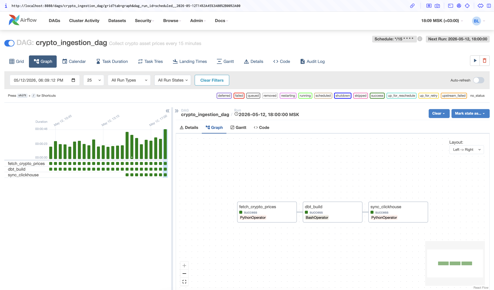
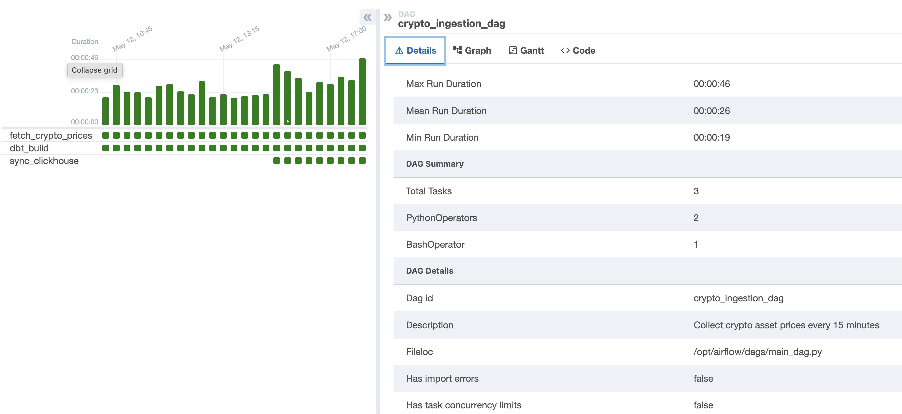
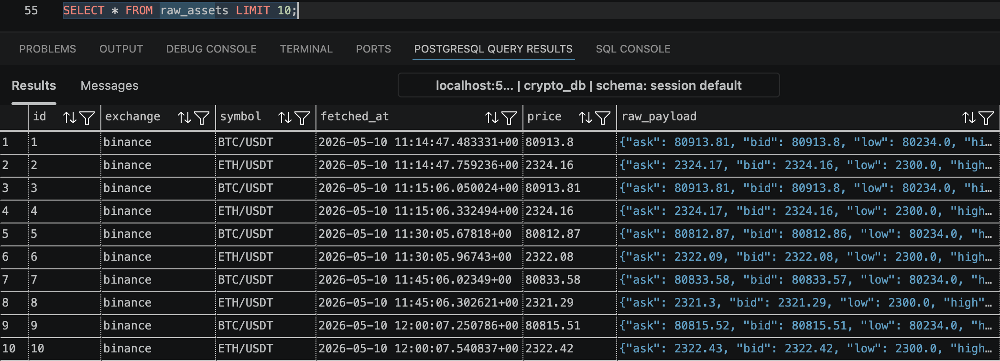
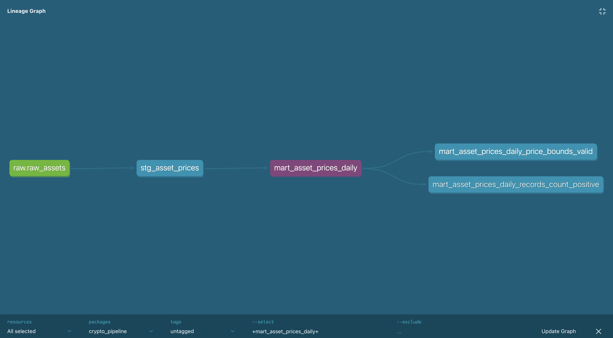
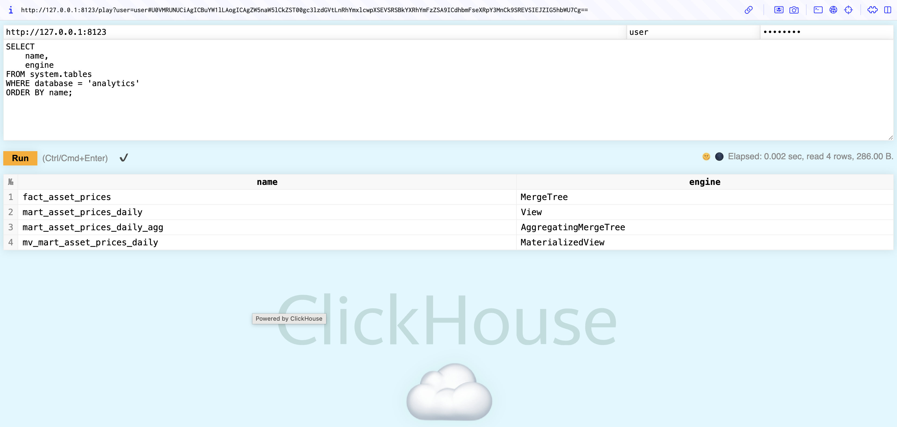
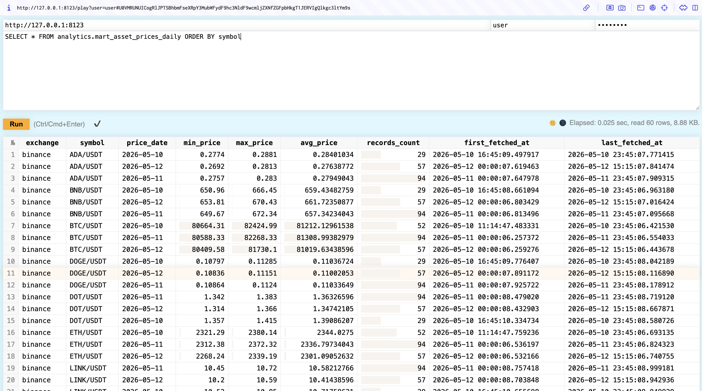
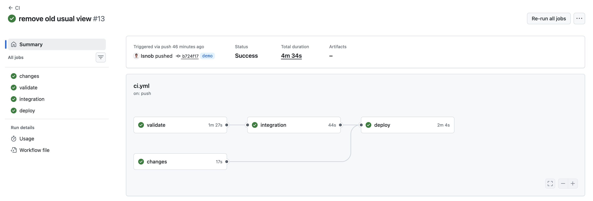

# End-to-End Crypto Data Pipeline

[Русская версия](./README.md)

A data engineering pet project: automated live crypto price ingestion, Airflow orchestration, dbt transformations, PostgreSQL raw/staging storage, and a ClickHouse OLAP layer.

The project demonstrates the full data path:

```text
Binance API -> Airflow -> PostgreSQL -> dbt -> ClickHouse -> analytical mart
```

## What Is Built

- Ingestion every 15 minutes through an Airflow DAG.
- Raw data is stored in PostgreSQL.
- dbt builds staging/mart models and runs data tests.
- Clean staging data is synchronized into ClickHouse.
- ClickHouse stores a fact table and a materialized daily mart through `AggregatingMergeTree`.
- GitHub Actions validates the project and automatically deploys the `demo` branch to the server.
- All services run in Docker Compose and are accessed through SSH tunnels.

## Architecture

```text
crypto_ingestion_dag

fetch_crypto_prices
  -> PostgreSQL public.raw_assets

dbt_build
  -> PostgreSQL analytics.stg_asset_prices
  -> PostgreSQL analytics.mart_asset_prices_daily
  -> dbt tests

sync_clickhouse
  -> ClickHouse analytics.fact_asset_prices
  -> ClickHouse materialized daily mart
```

ClickHouse mart:

```text
analytics.fact_asset_prices
  -> analytics.mv_mart_asset_prices_daily
  -> analytics.mart_asset_prices_daily_agg
  -> analytics.mart_asset_prices_daily
```

`mart_asset_prices_daily` is a read view for analytical queries. It no longer aggregates directly from the fact table: new data is written into aggregate states through a materialized view.

## Tech Stack

| Layer | Technology |
|---|---|
| Ingestion | Python, CCXT |
| Orchestration | Apache Airflow |
| Raw/Staging Storage | PostgreSQL 15 |
| Transformations | dbt |
| OLAP Storage | ClickHouse |
| Containers | Docker, Docker Compose |
| CI/CD | GitHub Actions |
| Deployment | SSH deploy to VPS |

## Screenshots

### Airflow DAG

Airflow orchestrates the full pipeline: ingestion, dbt build, and ClickHouse sync.



### Successful Pipeline Run

All DAG tasks complete successfully: data is collected, dbt models are updated, and ClickHouse is synchronized.



### PostgreSQL Raw Data

The raw layer stores live price snapshots fetched from Binance through CCXT.



### dbt Docs

dbt documentation shows model lineage and the transformation layer structure.



### ClickHouse Schema

ClickHouse contains a fact table, materialized view, aggregate table, and read view.



### ClickHouse Daily Mart

The final daily mart is available for analytical queries in ClickHouse.



### CI/CD

GitHub Actions runs validation, integration checks, and deploy.



## Data Model

### PostgreSQL

```text
public.raw_assets
analytics.stg_asset_prices
analytics.mart_asset_prices_daily
```

`raw_assets` stores source snapshots:

```sql
CREATE TABLE raw_assets (
    id SERIAL PRIMARY KEY,
    exchange TEXT NOT NULL,
    symbol TEXT NOT NULL,
    fetched_at TIMESTAMPTZ NOT NULL,
    price NUMERIC NOT NULL,
    raw_payload JSONB NOT NULL
);
```

`stg_asset_prices` cleans raw data and deduplicates observations by `exchange`, `symbol`, and `fetched_at` minute.

`mart_asset_prices_daily` in PostgreSQL remains a dbt mart used to demonstrate dbt incremental models.

### ClickHouse

```text
analytics.fact_asset_prices                  MergeTree
analytics.mv_mart_asset_prices_daily         MaterializedView
analytics.mart_asset_prices_daily_agg        AggregatingMergeTree
analytics.mart_asset_prices_daily            View
```

`fact_asset_prices` stores clean price facts.

`mv_mart_asset_prices_daily` reacts to new inserts into the fact table.

`mart_asset_prices_daily_agg` stores aggregate states:

```text
minState(price)
maxState(price)
avgState(price)
countState()
```

`mart_asset_prices_daily` exposes normal analytical fields:

```text
min_price
max_price
avg_price
records_count
first_fetched_at
last_fetched_at
```

## Repository Structure

```text
.github/workflows/ci.yml              CI/CD pipeline
clickhouse/migrations/                ClickHouse schema migrations
clickhouse/migrate.sh                 ClickHouse migration runner
dags/main_dag.py                      Airflow DAG
dbt/models/                           dbt staging and mart models
dbt/tests/                            dbt custom data tests
scripts/sync_postgres_to_clickhouse.py PostgreSQL -> ClickHouse sync
docker-compose.yml                    Service definitions
Dockerfile.airflow                    Airflow image with project deps
Dockerfile.dbt                        dbt image
ROADMAP.md                            Project roadmap
```

## Deployment Flow

The `demo` branch is used as the deployment branch.

```text
push to demo
  -> GitHub Actions validate
  -> GitHub Actions integration
  -> SSH deploy
  -> git pull --ff-only origin demo
  -> ClickHouse migrations
  -> docker compose up -d --build
```

Deploy runs only for runtime changes:

```text
dags/**
scripts/**
dbt/**
clickhouse/**
docker-compose.yml
Dockerfile*
requirements*.txt
```

Documentation-only changes pass CI but do not trigger deploy.

## Access Through SSH Tunnels

Services are bound to `127.0.0.1` on the server and are not exposed directly to the internet.

Common tunnel from the local machine:

```bash
ssh -N \
  -L 8080:127.0.0.1:8080 \
  -L 8081:127.0.0.1:8081 \
  -L 5433:127.0.0.1:5433 \
  -L 8123:127.0.0.1:8123 \
  -L 9000:127.0.0.1:9000 \
  bogdan@111.88.150.78
```

Available services after the tunnel:

| Service | URL / Connection |
|---|---|
| Airflow | `http://127.0.0.1:8080` |
| dbt docs | `http://127.0.0.1:8081` |
| PostgreSQL | `127.0.0.1:5433`, database `crypto_db` |
| ClickHouse HTTP | `http://127.0.0.1:8123` |
| ClickHouse Play UI | `http://127.0.0.1:8123/play` |
| ClickHouse native | `127.0.0.1:9000` |

Pet-project credentials:

```text
Airflow:    airflow / airflow
PostgreSQL: user / password
ClickHouse: user / password
```

## Useful Commands

Start services:

```bash
docker compose up -d --build
```

Check containers:

```bash
docker compose ps
```

Run dbt manually:

```bash
docker compose run --rm dbt build
```

Generate and serve dbt docs:

```bash
docker compose run --rm dbt docs generate
docker compose run --rm -p 127.0.0.1:8081:8081 dbt docs serve --host 0.0.0.0 --port 8081
```

Apply ClickHouse migrations:

```bash
docker compose up --build --force-recreate clickhouse-migrate
```

Connect to PostgreSQL:

```bash
psql -h 127.0.0.1 -p 5433 -U user -d crypto_db
```

Connect to ClickHouse with a local client:

```bash
clickhouse-client \
  --host 127.0.0.1 \
  --port 9000 \
  --user user \
  --password password \
  --database analytics
```

Open ClickHouse Play UI:

```text
http://127.0.0.1:8123/play
```

## Verification Queries

PostgreSQL raw:

```sql
SELECT
    symbol,
    price,
    fetched_at
FROM public.raw_assets
ORDER BY fetched_at DESC
LIMIT 20;
```

PostgreSQL dbt staging:

```sql
SELECT
    exchange,
    symbol,
    fetched_at,
    price
FROM analytics.stg_asset_prices
ORDER BY fetched_at DESC
LIMIT 20;
```

ClickHouse objects:

```sql
SELECT
    name,
    engine
FROM system.tables
WHERE database = 'analytics'
ORDER BY name;
```

ClickHouse fact table:

```sql
SELECT
    count() AS rows_count,
    max(raw_asset_id) AS last_raw_asset_id
FROM analytics.fact_asset_prices;
```

ClickHouse daily mart:

```sql
SELECT *
FROM analytics.mart_asset_prices_daily
ORDER BY price_date DESC, symbol
LIMIT 20;
```

## Current Limitations

- Ingestion collects live snapshots only.
- There is no historical backfill for periods when the server or Airflow was down.
- Credentials are intentionally simple because this is a pet project.
- Services are protected by localhost bindings and SSH tunnels, not by production-grade secret management.

## Roadmap

The main project stages are tracked in [ROADMAP.md](./ROADMAP.md). Current state: ingestion, orchestration, dbt, CI/CD, and the ClickHouse OLAP layer are implemented.
